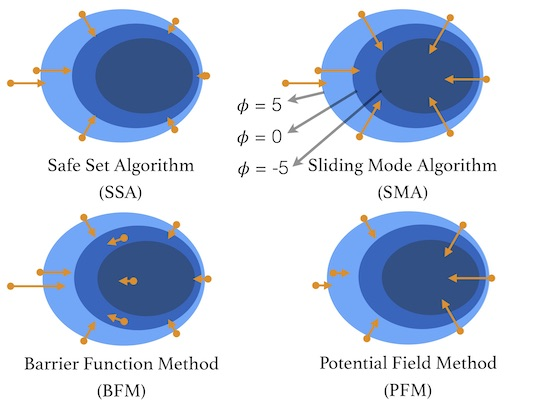
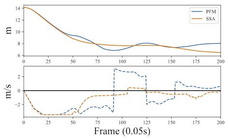

# BIS

### Introduction

BIS is an open source benchmark for safe control algorithms. 

You can evaluate your algorithm on various robot models, including ball model, unicycle model, robot arm model, etc. 


We also provide comparison with different algorithms. Currently implemented algorithms including Potential Field method, Safe Set algorithm, Sliding Model algorithm, Barrier Function algorithm, and Sublevel Safe Set algorithm. 



Various metrics are provided. Numerical analysis like Safety-Efficiency trade-off curves and Speed profile.





We also provided visual comparison tools.


### Install

To install this repository:

```bash
cd YOURPATH
git clone git@github.com:Wei-TianHao/BIS.git
#create a virtual environment named psb_env, using the latest python3.6
conda create -n BIS python=3.6
#activate the virtual env
source activate BIS
#install requirement packages
pip install -r requirements.txt
#The next step is only required for MacOS:
#to use matplotlib.pyplot in a conda virtual environment, we need to install python as a framework
conda install python.app
```
### Tutorial

To add new algorithm and new model, please refer to tutorial.ipynb

To get the results on our paper, please run

```bash
python leaderboard.py
```

To see a demo, please run
```bash
python test.py
```

### Document

Detailed documents can be found at <https://wei-tianhao.github.io/BIS/>.